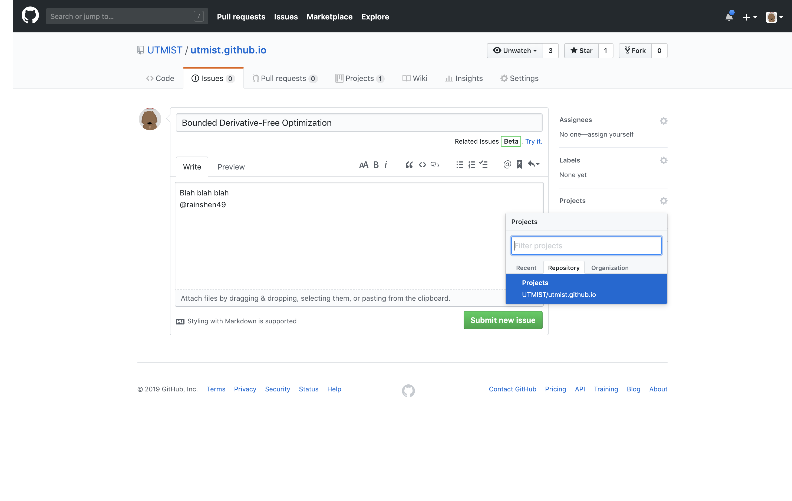
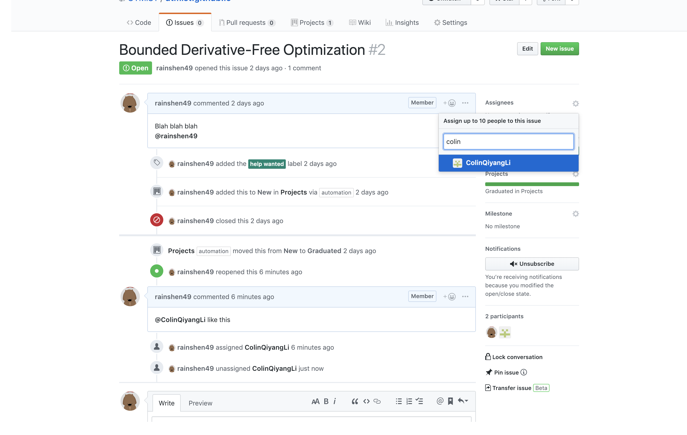
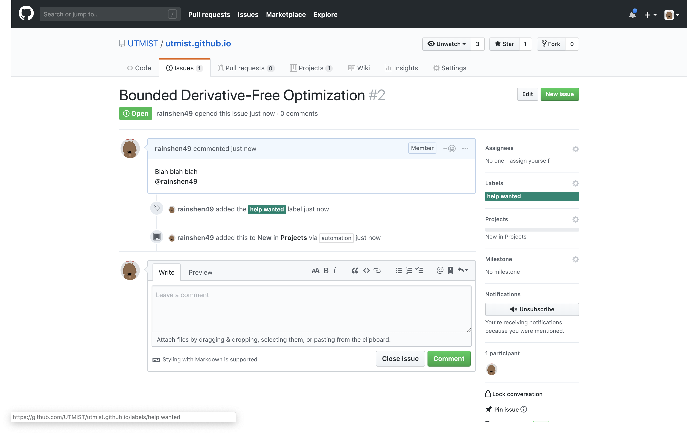
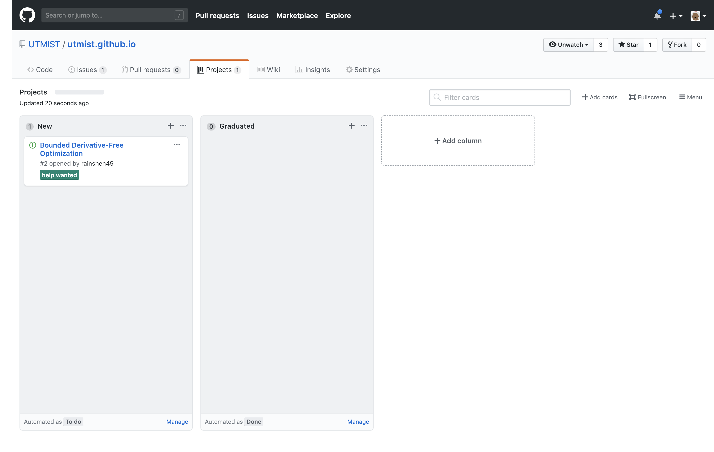

# Project

- New project
  - Open a new issue, assign to UTMIST/Projects

- Team formation
  - project owner: add people by assigning them in the issue
  - members: comment below to request project owner to assign you

- Incubating Project
  - as the project is in development, add a `help wanted` tag to recruit more people if needed

- Graduation
  - Once the project is good enough to live in its own repository: close the issue and create a new repository. Changes will be reflected in the project dashboard

