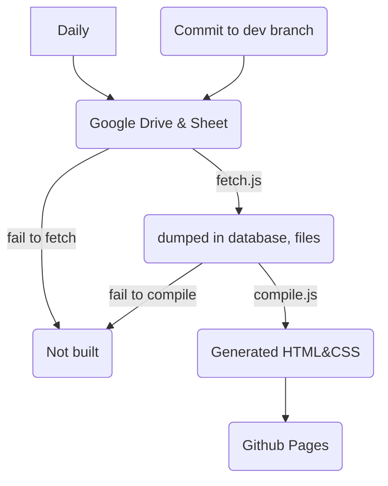

# utmist.github.io

Home page for UTMIST.

# Stack

Get familiar with the following language/framework/toolchain:

- HTML + CSS (no JavaScript on the Frontend)
- [Pug](https://pugjs.org/api/getting-started.html), a templating language
- Node.js, for building the site and continuous integration
- We exclusively used `Yarn` for node package management.
- TypeScript, type-checked JavaScript
- Google Sheet API + Google Drive API, as a CMS/PseudoDatabase
- Travis CI, a continuous integration service used here to build websites when the data change

# How To X

## Setup environment

- Make sure [node.js](https://nodejs.org/en/) and [yarn](https://yarnpkg.com/en/) are installed. Some Debian/Ubuntu versions may have `npm` as [a prerequisite](https://github.com/yarnpkg/yarn/issues/2821) for `yarn`.
- Clone the repository, `cd` into the root.
- Install packages by running `yarn`.
- Upgrade packages if necessary by running `yarn upgrade`.
- Use a static server of your choice to serve the repository, navigate to `index.html`
- To compile `.pug` templates in watch mode, run `yarn start`.
- To compile the templates just once, run `yarn build`.

## Update Content

- Events/Execs: update the corresponding Google Sheet or use the Google Form, Travis CI will automatically update the site daily
- Other components: find the corresponding resource in the repository, make changes and commit

## Add Sub-page

- One simple page/component
  - Add a new `.pug` file in the repository root
    - If the file describes a complete page (starts with \<html\>), just compile after you are done, you should see a new `.html` file with the same name as the `.pug`
    - If the `.pug` file is a component, include it in the existing `.pug` files and compile
  - **DON'T DIRECTLY EDIT THE HTML**, they are generated from `.pug` and will get overwritten daily
- Self-contained sub directory
  - Create a sub directory in the repository root (e.g. `new_site`)
  - Put all your files in there, treat it as a separate static website
  - Remember to serve from the root and navigate to `localhost\new_site\`, because Github will serve the page with `utmist.github.io\new_site\`

# Folder Structure

- `assets\`: static assets such as images, video, large text
- `common\`: components used to stitch together a web page
- `Fonts\,Log\`: website branding
- `database\`: JSON copies of UTMIST data, fetched from Google Sheets, used by Travis to generate the site. It is not really a database, but acts as the source of "business data".
- `files\`: files referenced by the `database`
- `index.css,index.html,index.pug`: entry point when users visit utmist.github.io
- `node_modules\`: packages downloaded by npm or yarn. Not tracked by git.
- `.nojekyll`: Github by default tries to build the repository with Jekyll, but our site is totally static, turning it off speeds up deployment (almost instant)
- `.travis.yml`: configures how Travis builds the site, please put security tokens in Travis environment variables instead of here
- `compile.js`: load in data from `database` and compiles `.pug` files
- `watch.js`: compile on file change, useful for development
- `fetch.js,fetch.ts`: grabs info from Google Sheet and Google Drive and dump into `database\` and `files\`, used by Travis
- `package.json,yarn.lock`: file used by yarn/npm to track dependencies
- `tsconfig.json`: tells TypeScript how to check and compile `.ts` code

# Build Process

The build process is designed to minimize the manual house-keeping of the developer. For frequent changes such as adding events and adding members, Google Sheet API & Google Drive API pull the changes into the repository automatically. This process is run by Travis.

Remember to put Google API tokens and Github tokens in Travis environment variables, not in plain text anywhere in the repository.
